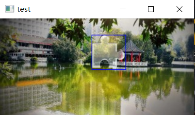

# 图形学实验：基于明度变化的简易验证码匹配算法

## 使用

### 示例效果

环境要求：Python 3.10, opencv-python ^4.5.5.64, numpy

```shell
./validateMatch> python test.py
```

### 修改与使用

环境要求：Python 3.10, opencv-python ^4.5.5.64, numpy

修改test.py的第6行，将“imgs/background3.jpg”，修改为特定的验证码背景图。

修改imgs/pattern.jpg与imgs/patternD.jpg，以达到特定形状的匹配目的。


## 简介
该匹配算法基于背景图片中的明度变化对验证码进行匹配，通过对验证码背景以特定阈值进行二值化，并对二值化之后的二值图通过异或算法与pattern进行匹配，找出匹配度最高的两组结果（异或矩阵后求和，和越小，匹配度越大），对这两组结果再做一次匹配，判断其与最下部上凸部分的匹配情况，找出匹配度最高的结果就是目标结果。

## 简易验证码示例


## 匹配示例


